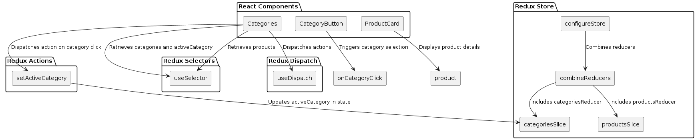
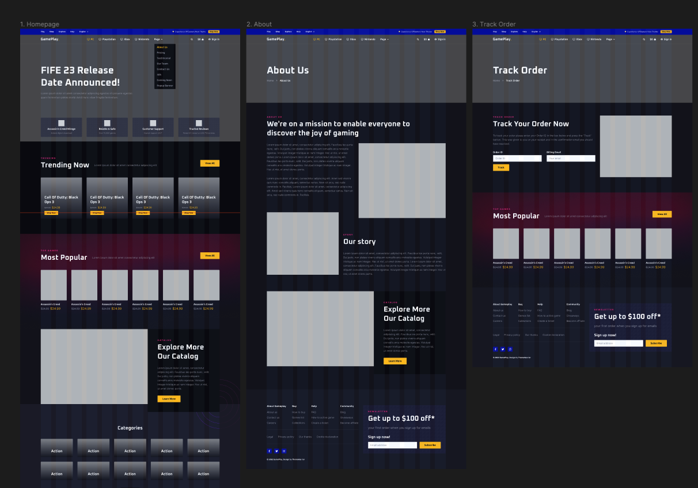

# LAB - Class 36

## Project: StoreFront

### Author: Bryan O. Garduno Gonzalez

### Problem Domain

Create a user-friendly and visually appealing web application that allows users to browse products by categories. The main challenges include efficiently managing the state of categories and products using Redux, implementing an intuitive user interface for seamnless navigation, handling the association between categories and products for quick filtering, and designing a visually appealing layout using Material UI components to enhance the user experience.

### Links and Resources

- Main Branch [Deployment](https://store-front-three-iota.vercel.app/)

### Collaborators

- **ChatGPT by OpenAI**: Used as a programming partner for brainstorming ideas, debugging code, formulating tests, and drafting documentation.

### Setup

#### `.env` requirements (where applicable)

A .env file is included in local repository. A .env-sample file is uploaed to the remote repo so collaborators understand what environmental variables are being used.

#### How to initialize/run your application (where applicable)

- e.g. `npm start`

#### How to use your library (where applicable)

## Features

This e-commerce application incorporates the following key features:

- **Redux for State Management**: The application utilizes Redux to efficiently manage the state of categories and products. Redux allows for a centralized store that holds the application state, making it easier to manage and update data across different components. The Redux store is configured using `configureStore` from the `@reduxjs/toolkit` library, and the reducers for categories and products are combined using `combineReducers`.

- **Material UI for UI Components**: The application leverages Material UI, a popular React UI framework, to create a visually appealing and responsive user interface. Material UI provides a wide range of pre-built components, such as `Box`, `Stack`, `Typography`, `Grid`, `Button`, `Card`, and more, which are used throughout the application to create a consistent and polished look.

- **Responsive Layout**: The application is designed to be responsive and adapt to different screen sizes. Material UI's grid system is employed to create a flexible layout that adjusts based on the device's viewport. The `Grid` component is used to arrange the category buttons and product cards in a responsive grid format.

- **Category Selection**: The application allows users to browse products by selecting a category. The list of categories is stored in the Redux store and rendered using the `CategoryButton` component. When a category is clicked, the `setActiveCategory` action is dispatched, updating the active category in the Redux store.

- **Product Filtering**: When a category is selected, the application filters the products based on the active category. The `filteredProducts` array is derived from the Redux store's `products` state and the `activeCategory`. Only the products associated with the selected category are displayed.

- **Product Card**: Each product is displayed using the `ProductCard` component, which utilizes Material UI's `Card`, `CardContent`, `Typography`, `IconButton`, and `Button` components. The product card showcases the product name, description, price, inventory count, and provides an "Add to Cart" button and a favorite icon.

- **Redux Slices**: The application organizes the Redux state using slices, which are created using the `createSlice` function from the `@reduxjs/toolkit` library. The `categoriesSlice` manages the state related to categories, including the list of categories and the active category. The `productsSlice` handles the state for the list of products.

These features collectively contribute to creating an intuitive and visually appealing e-commerce application that allows users to browse products by categories, view product details, and interact with the application seamlessly.

## Tests

### Testing Setup and Implementation

### Component Testing

### Running the Tests

To run the tests, execute the `npm test` command.

### Incomplete or Skipped Tests

At this stage, all essential component tests have been implemented. Any future tests or enhancements will be noted in subsequent updates or phases.

#### UML

;

### Figma Design 

